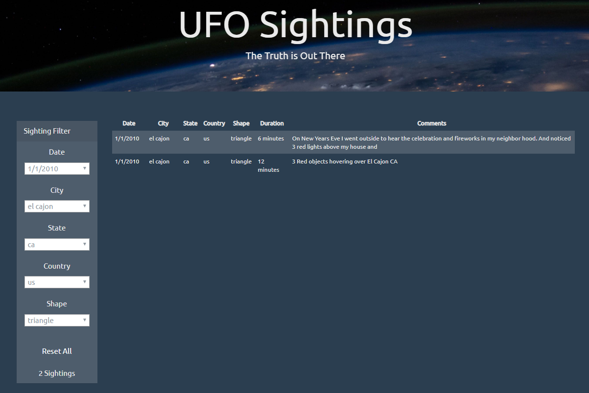

# javascript-challenge

The challenge was to construct an interactive website that filtered UFO sightings.

Each filter criteria had a reasonably small set of possible values, so this site accepts user input as dropdown selectors, to avoid the issues of free-form input fields.

In the option lists for the dropdowns, this site prepends and initially selects an "All" value.

To let the user get back to the start, the "Reset All" button sets each dropdown to "All", and then retrieves all the sightings.

As a convenience, this site counts the currently-filtered sightings. 

Note:  
* I had completed most of this assignment before the sessions on D3.  I tried to retrofit some D3 features into the code, but failed.  In particular, I found no need for the d3.event.preventdefault function.  The page did not appear to be re-drawing in response to user interaction.
* Further work could include providing correct capitalization for the city and state names, and country abbreviations.
* Further work could include cross-filtering of the dropdown options.  For example, if the user's initial selection was for the country to be Canada, the other four filters would reduce to the two values that are appropriate for the two Canadian sightings.

